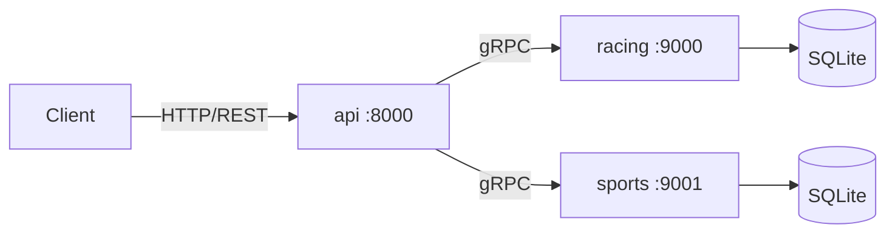

# Architecture

## Overview

The system consists of three microservices:

| Service | Port | Role |
|---------|------|------|
| api | 8000 | HTTP gateway (grpc-gateway), translates REST to gRPC |
| racing | 9000 | Racing domain service, gRPC + SQLite |
| sports | 9001 | Sports domain service, gRPC + SQLite |



## Service Structure

Both `racing` and `sports` follow the same layered layout:

```text
proto/   -- protobuf definitions (interface contract)
service/ -- business logic
db/      -- data access (repository pattern)
```

The `api` service has no business logic. It only holds the annotated proto files (with `google.api.http` options) and uses grpc-gateway to expose the backend RPCs as REST endpoints.

## Tech Stack

- Go 1.16+
- gRPC + grpc-gateway
- Protocol Buffers 3
- SQLite via go-sqlite3 (requires CGO)
- golangci-lint for static analysis
